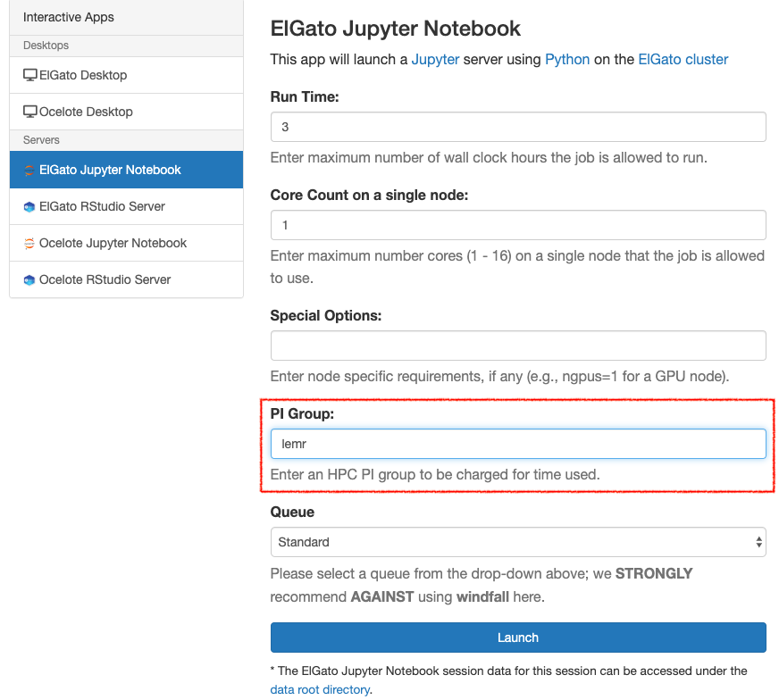
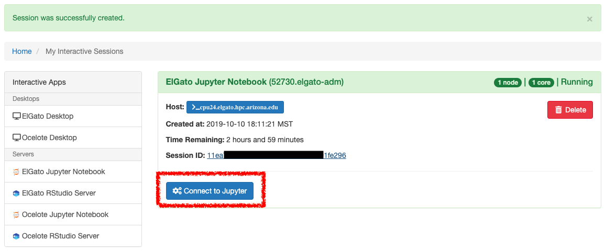
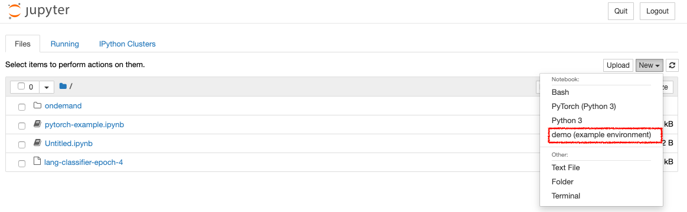
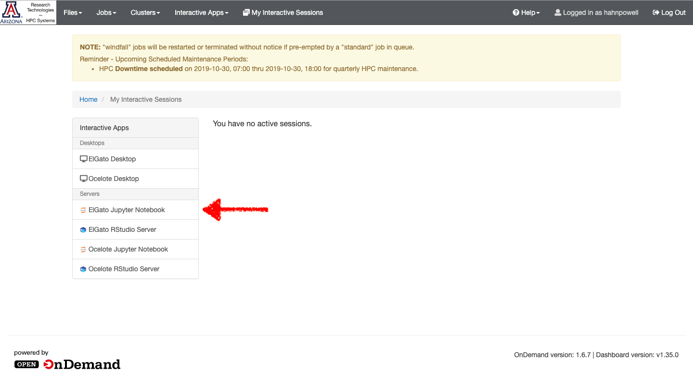
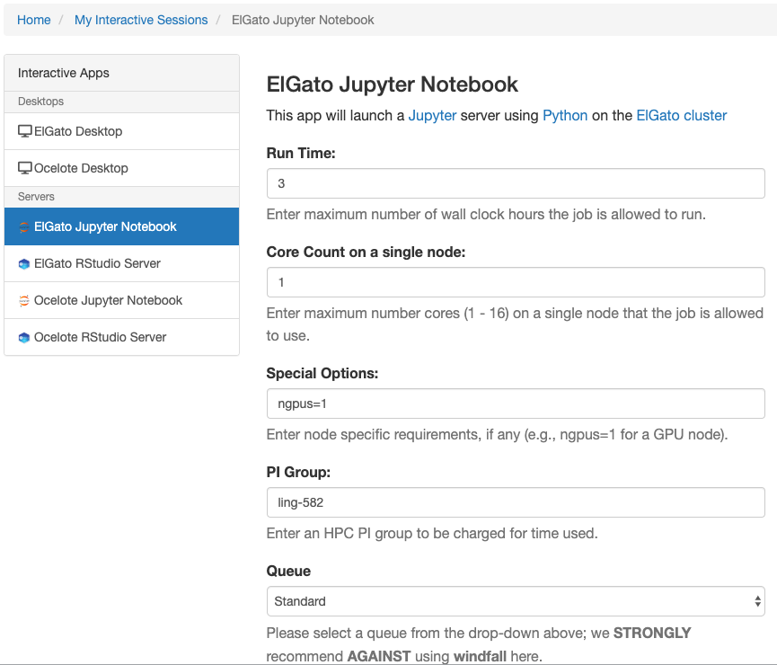

## Getting started: custom kernels

If you wish to use a set of custom dependencies and/or a custom kernel, take a look at the following tutorials:

1. [**Installing custom Python environments**](../install-custom-python-environments/README.md)  

2. [**Installing custom Jupyter kernels**](../install-custom-jupyter-kernels/README.md)

## Launching a jupyter notebook

At the time of this writing, notebooks on the HPC must be launched using the Open OnDemand portal (https://https://ood.hpc.arizona.edu/).

### Step 1: Configure

From the **Interactive Apps** dropdown menu, select **ElGato Jupyter Notebook** under the **Servers** block.

### Step 2: Launch

## Using a custom kernel    

## Shutting down jupyter

## Launching a GPU-powered notebook

In order to access a GPU from the notebook, you'll need to specify the `ngpus=` option under **Special Options**.  For example, to allocate a single GPU, use `ngpus=1`.

If you're trying to make use of a GPU with a deep learning framework such as [`PyTorch`](https://pytorch.org), ensure that you've installed the appropriate version of the library and have loaded the necessary CUDA version ([see the **Loading custom Modules** tutorial](../load-custom-modules/README.md)).